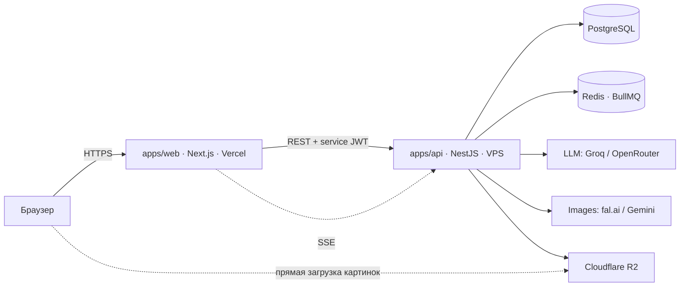
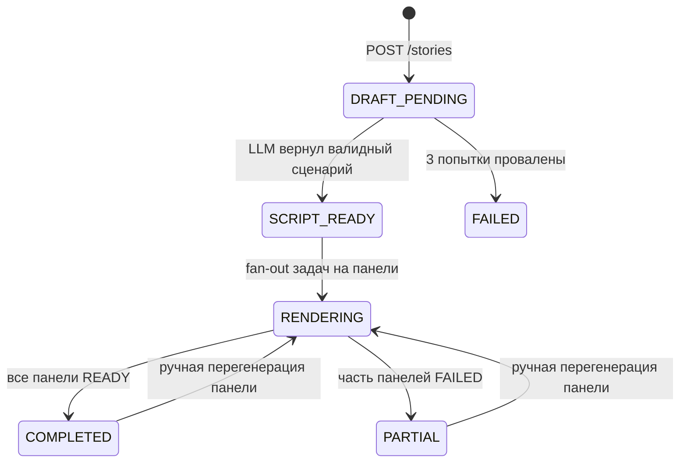

# AI Story Forge — Архитектура

Документ описывает целевую архитектуру. Он же — черновик того, что позже станет
разделом README для рекрутёров и опорой для рассказа на интервью.

---

## 1. Что мы строим и в чём сложность

Пользователь вводит идею («кот-детектив расследует пропажу золотой рыбки в неоновом
мегаполисе») и получает визуальную историю из 4 панелей: текст сцены + иллюстрация.

Технически интересное здесь — не CRUD и не UI, а то, что **одна кнопка запускает
долгий, дорогой, частично отказывающий распределённый процесс**:

| Свойство процесса               | Что из этого следует                                                |
| ------------------------------- | ------------------------------------------------------------------- |
| Длится 30–120 секунд            | Нельзя делать синхронный HTTP-запрос → очередь + асинхронный статус |
| Состоит из 5+ независимых шагов | Частичные результаты, независимые ретраи                            |
| Каждый шаг стоит денег          | Квоты, учёт стоимости, защита от абуза                              |
| Внешние API нестабильны         | Backoff, таймауты, fallback между провайдерами                      |
| LLM возвращает «почти JSON»     | Валидация схемы + повторный запрос при провале                      |

Вся архитектура ниже — следствие этой таблицы.

---

## 2. Границы сервисов



### apps/web — Next.js (Vercel)

Отвечает за UI и за сессию пользователя. Работает как BFF: сам никуда, кроме `api`,
не ходит.

- App Router, Server Components для чтения, Server Actions для мутаций.
- NextAuth в режиме **JWT-сессий, без database adapter**. Это принципиально: у `web`
  нет и не будет доступа к Postgres.
- Каждый вызов `api` подписывается коротким сервисным JWT (HS256, TTL 60 секунд,
  общий секрет), в payload — `userId`, `email`, `role`.
- Проксирует SSE-поток от `api` к браузеру.

**Чего в `web` нет:** Prisma, миграций, ключей от LLM/image-провайдеров, бизнес-логики
генерации.

### apps/api — NestJS (VPS, Docker)

Владелец домена и **единственный процесс, который пишет в Postgres**.

Модули:

| Модуль       | Ответственность                                                        |
| ------------ | ---------------------------------------------------------------------- |
| `auth`       | Проверка сервисного JWT, upsert пользователя при первом заходе         |
| `stories`    | CRUD историй и панелей, ручное редактирование текста                   |
| `generation` | Оркестрация: постановка задач, машина состояний, SSE-события           |
| `llm`        | Клиент LLM, промпт-шаблоны, валидация ответа через zod                 |
| `images`     | Клиенты fal.ai и Gemini за одним интерфейсом, выбор по режиму качества |
| `storage`    | Загрузка в R2, выдача публичных URL                                    |
| `billing`    | Квоты пользователя, учёт стоимости каждой генерации                    |
| `health`     | Liveness/readiness, метрики очереди                                    |

Воркеры BullMQ живут в том же процессе (отдельный контейнер — уже overkill для
портфолио, но вынести — вопрос одной строки в конфиге).

### Почему два сервиса, а не монолит

Честный ответ на интервью: `api` держит **фоновые воркеры и долгоживущие
SSE-соединения**, чего serverless-платформа не позволяет. Поэтому он на VPS, а `web`
на Vercel ради edge-раздачи и preview-деплоев. Разделение продиктовано моделью
исполнения, а не желанием «сделать микросервисы».

---

## 3. Модель данных

```prisma
model User {
  id        String   @id @default(cuid())
  email     String   @unique
  name      String?
  createdAt DateTime @default(now())

  stories   Story[]
  quota     Quota?
}

model Quota {
  userId          String   @id
  user            User     @relation(fields: [userId], references: [id], onDelete: Cascade)
  draftUsed       Int      @default(0)   // истории в режиме draft
  consistentUsed  Int      @default(0)   // истории в режиме consistent
  periodStartedAt DateTime @default(now())
}

model Story {
  id          String       @id @default(cuid())
  userId      String?                       // null = гостевая история
  guestKey    String?                       // хеш IP+UA для гостевых квот
  idea        String       @db.Text
  title       String?
  styleId     String                        // пресет визуального стиля
  quality     Quality                       // DRAFT | CONSISTENT
  status      StoryStatus
  isShowcase  Boolean      @default(false)  // витринные истории на лендинге
  characters  Json?                         // «паспорта» персонажей, см. §6
  costCents   Int          @default(0)
  error       String?
  createdAt   DateTime     @default(now())
  updatedAt   DateTime     @updatedAt

  user        User?        @relation(fields: [userId], references: [id])
  panels      Panel[]
  jobs        GenerationJob[]

  @@index([userId, createdAt])
  @@index([isShowcase])
}

model Panel {
  id          String      @id @default(cuid())
  storyId     String
  order       Int
  caption     String      @db.Text        // текст сцены, редактируется вручную
  imagePrompt String      @db.Text
  imageUrl    String?                     // R2, null пока не сгенерировано
  imageKey    String?                     // ключ объекта в R2 для удаления
  status      PanelStatus
  attempts    Int         @default(0)
  error       String?

  story       Story       @relation(fields: [storyId], references: [id], onDelete: Cascade)

  @@unique([storyId, order])
}

model GenerationJob {
  id             String    @id @default(cuid())
  storyId        String
  panelId        String?
  kind           JobKind   // SCRIPT | PANEL_IMAGE
  status         JobStatus
  idempotencyKey String    @unique
  provider       String?
  costCents      Int       @default(0)
  latencyMs      Int?
  error          String?
  createdAt      DateTime  @default(now())
  finishedAt     DateTime?

  story          Story     @relation(fields: [storyId], references: [id], onDelete: Cascade)

  @@index([storyId])
}

enum Quality      { DRAFT CONSISTENT }
enum StoryStatus  { DRAFT_PENDING SCRIPT_READY RENDERING COMPLETED PARTIAL FAILED }
enum PanelStatus  { PENDING GENERATING READY FAILED }
enum JobKind      { SCRIPT PANEL_IMAGE }
enum JobStatus    { QUEUED RUNNING SUCCEEDED FAILED }
```

`GenerationJob` — не дубликат BullMQ, а бизнес-журнал: он переживает очистку Redis и
даёт историю попыток, стоимость и латентность для админского экрана.

---

## 4. Жизненный цикл генерации



Ключевое решение: **`PARTIAL` — нормальное состояние, а не ошибка**. Три панели из
четырёх — это работающая история, которую пользователь видит и может починить одной
кнопкой. Полный провал (`FAILED`) наступает только если не удался сценарий.

Порядок шагов:

1. `POST /stories` валидирует идею, проверяет квоту, создаёт `Story` в
   `DRAFT_PENDING`, кладёт задачу `SCRIPT` в очередь и **сразу** отдаёт `202` с id.
2. Воркер `SCRIPT` зовёт LLM, парсит ответ через zod. Невалидный JSON → повтор с
   добавленным в промпт текстом ошибки, до 3 раз. Успех → создаются 4 `Panel` в
   `PENDING`, статус `SCRIPT_READY`. **Текст истории уже виден пользователю** — он не
   ждёт картинок, чтобы начать читать.
3. Fan-out: 4 задачи `PANEL_IMAGE`, конкурентность 2 (чтобы не ловить 429).
4. Каждый воркер генерирует картинку, скачивает её по временному URL провайдера,
   кладёт в R2, пишет `imageUrl`, шлёт SSE-событие.
5. Когда терминальных панелей стало 4 — история переходит в `COMPLETED` или `PARTIAL`.

### Надёжность

- **Идемпотентность.** `idempotencyKey = hash(storyId, kind, panelId, attempt)`.
  Повторная доставка задачи не приводит к повторной оплате.
- **Ретраи.** BullMQ, экспоненциальный backoff 2s → 8s → 30s, максимум 3 попытки.
  Ошибки делятся на retryable (429, 5xx, таймаут) и фатальные (400, отказ модерации);
  вторые не ретраятся вообще.
- **Таймауты.** 30 с на LLM, 90 с на картинку, `AbortController` на клиенте провайдера.
- **Fallback.** Если основной image-провайдер отдал 5xx дважды подряд — переключение
  на запасного (fal.ai ⇄ Gemini) с пометкой в `GenerationJob.provider`.
- **Осиротевшие истории.** Cron раз в 10 минут переводит всё, что висит в
  `RENDERING` дольше 15 минут, в `PARTIAL`.

---

## 5. Контракты API

Все эндпоинты требуют сервисный JWT в `Authorization: Bearer`. Гостевой доступ —
через тот же механизм с `role: "guest"` и `guestKey` вместо `userId`.

```
POST   /v1/stories                     → 202 { storyId, status }
GET    /v1/stories?cursor=&limit=      → 200 { items, nextCursor }
GET    /v1/stories/:id                 → 200 { story, panels[] }
GET    /v1/stories/:id/events          → SSE
PATCH  /v1/panels/:id                  → 200   ручное редактирование caption
POST   /v1/panels/:id/regenerate       → 202 { jobId }   опц. { imagePrompt }
DELETE /v1/stories/:id                 → 204
GET    /v1/showcase                    → 200   витринные истории, публично, кэш 1 час
GET    /v1/me/quota                    → 200 { draftLeft, consistentLeft, resetsAt }
```

**Тело `POST /v1/stories`:**

```json
{
  "idea": "string, 10–500 символов",
  "styleId": "noir-neon | watercolor | comic-90s | pixel",
  "quality": "draft | consistent",
  "panelCount": 4
}
```

**События SSE** (`event:` + JSON в `data:`):

| Событие              | Payload                                           |
| -------------------- | ------------------------------------------------- |
| `story.script_ready` | `{ title, panels: [{ id, order, caption }] }`     |
| `panel.generating`   | `{ panelId }`                                     |
| `panel.ready`        | `{ panelId, imageUrl }`                           |
| `panel.failed`       | `{ panelId, error, retryable }`                   |
| `story.completed`    | `{ status: "COMPLETED" \| "PARTIAL", costCents }` |

Heartbeat-комментарий каждые 15 секунд, иначе прокси рвут соединение. Клиент при
разрыве делает `GET /v1/stories/:id` и переподключается — состояние всегда
восстановимо из БД, SSE лишь ускоряет доставку.

Ошибки — RFC 7807 (`application/problem+json`) с полями `type`, `title`, `status`,
`detail`, `traceId`.

---

## 6. Промпты и консистентность персонажа

Самая заметная проблема жанра: на четвёртой панели кот-детектив — уже другой кот.
Решаем на двух уровнях.

**Уровень 1. «Паспорт персонажа».** LLM на шаге сценария возвращает не только сцены,
но и `characters[]` — фиксированное визуальное описание каждого героя (вид, окрас,
одежда, характерная деталь). Это описание дословно подставляется в промпт **каждой**
панели вместе с описанием стиля. Плюс общий `seed` на всю историю.

```
{styleDescription}. {characterSheet}. Scene: {sceneDescription}.
Composition: {shotType}, {cameraAngle}. No text, no speech bubbles, no watermark.
```

**Уровень 2 (режим `consistent`).** Первая панель генерируется обычным способом и
становится референсом: она передаётся на вход Gemini Flash Image при генерации
панелей 2–4. Модель принимает изображения на вход, поэтому персонаж переносится
почти буквально.

**Валидация ответа LLM.** Схема zod: 4 сцены, у каждой непустой `caption` (≤ 240
символов), `imagePrompt` на английском, `shotType` из перечисления. При провале —
повтор с ошибкой валидации в промпте. Один и тот же zod-объект используется как
источник для JSON Schema в structured output и как рантайм-валидатор.

---

## 7. Стоимость и защита от абуза

Актуальные цены (проверено 09.2026):

| Провайдер / модель     | За картинку 1K | История из 4 панелей |
| ---------------------- | -------------- | -------------------- |
| fal.ai FLUX.1 schnell  | $0.003         | $0.012               |
| Gemini 3.1 Flash Image | $0.067         | $0.268               |

Текстовая часть на Groq — бесплатно в рамках free tier.

Отсюда режимы:

| Режим      | Модель                                | Кому                        | Квота                                   |
| ---------- | ------------------------------------- | --------------------------- | --------------------------------------- |
| Showcase   | — (заранее сгенерировано, лежит в R2) | всем, без входа             | ∞                                       |
| Draft      | FLUX schnell                          | гостям и всем пользователям | 3 / сутки на гостя, 20 / месяц на юзера |
| Consistent | Gemini Flash Image                    | зарегистрированным          | 3 / месяц                               |

Потолок при полном исчерпании квот десятком пользователей — единицы долларов в
месяц. Дополнительно: глобальный дневной лимит расходов в `billing` (при превышении
`api` отдаёт `503` и показывает баннер «демо на паузе»), rate limit 5 запросов в
минуту на IP, реальная стоимость каждого job пишется в `GenerationJob.costCents`.

---

## 8. Хранение картинок

Провайдеры отдают временные URL, живущие часы. Воркер сразу скачивает картинку,
конвертирует в WebP (`sharp`) и кладёт в **Cloudflare R2** по ключу
`stories/{storyId}/{panelId}-{attempt}.webp`. R2 выбран из-за 10 ГБ бесплатно и
нулевой платы за исходящий трафик; интерфейс S3-совместимый, так что переезд на S3 —
смена переменных окружения. Раздача через публичный R2-домен, в `next.config` он
прописан в `images.remotePatterns`. При удалении истории объекты чистятся по
`imageKey`.

---

## 9. Наблюдаемость

- `pino` со структурным JSON, сквозной `traceId` от Server Action до воркера.
- Каждый вызов внешнего API логируется как одна запись: провайдер, модель, латентность,
  стоимость, статус, число попыток.
- `/health` отдаёт глубину очередей, число `RENDERING`-историй и последнюю ошибку
  провайдера.
- Sentry на обоих приложениях (free tier).
- Админ-страница `/admin/jobs` — таблица `GenerationJob` с фильтрами. Дёшево в
  реализации и очень хорошо смотрится на демо.

---

## 10. Деплой

| Что                           | Где            | Как                                                           |
| ----------------------------- | -------------- | ------------------------------------------------------------- |
| `apps/web`                    | Vercel         | git push, preview-деплои на PR                                |
| `apps/api` + Postgres + Redis | VPS            | `docker compose`, Caddy как reverse-proxy с авто-TLS          |
| Картинки                      | Cloudflare R2  | —                                                             |
| CI                            | GitHub Actions | lint → typecheck → unit → e2e (Testcontainers) → build образа |

Локально всё поднимается одной командой `docker compose up` + `pnpm dev`.
Монорепозиторий на pnpm workspaces, общий пакет `packages/contracts` с zod-схемами и
выведенными из них TypeScript-типами — один источник правды для обоих приложений.

---

## 11. Принятые решения и отвергнутые альтернативы

| Решение                             | Почему                                                  | Что отвергли                                           |
| ----------------------------------- | ------------------------------------------------------- | ------------------------------------------------------ |
| Асинхронная генерация через очередь | 30–120 с не влезают в лимит serverless-функции          | Синхронный запрос — гарантированный таймаут            |
| БД принадлежит только `api`         | Два писателя в одну схему = гонки и дублирование логики | Prisma в обоих приложениях                             |
| SSE                                 | Односторонний поток, работает поверх обычного HTTP      | WebSocket — избыточен; поллинг — лишняя нагрузка и лаг |
| NextAuth в JWT-режиме               | Иначе `web` понадобится доступ к БД                     | Database sessions                                      |
| BullMQ + Redis                      | Ретраи, backoff, конкурентность из коробки              | `setTimeout` в процессе — теряется при рестарте        |
| R2                                  | Бесплатный egress                                       | Vercel Blob дороже, S3 берёт за трафик                 |
| `PARTIAL` как валидный статус       | Частичный результат ценнее ошибки                       | Транзакция «всё или ничего»                            |

---

## 12. Открытые вопросы

- Нужна ли публичная шаринг-ссылка на историю (`/s/:slug` + OG-изображение)? Дёшево и
  сильно помогает демонстрации.
- Экспорт в PNG-полосу или PDF — приятный бонус, но не в MVP.
- Модерация ввода: полагаться на фильтры провайдера или ставить свою проверку до
  оплаты генерации.
